# OAVI_lab4
_Выделение границ изображений_

### Вариант 14

Была поставлена следующая задача:

### Выделение границ изображений
1.  Реализовать оператор Кайяли для выделения границ изображения.
2.  Вычислить градиенты по X и Y.
3.  Вычислить итоговый градиент.
4.  Нормализовать градиенты.
5.  Бинаризовать итоговый градиент с порогом, подобранным опытным путем.

***

## Функции

Функции для данной задачи находятся в файле `contour.py`.

-   `convolve(pix: np.ndarray, kernel: np.ndarray) -> np.ndarray`
    > Выполняет операцию свертки изображения с заданным ядром.
    >
    > _ПАРАМЕТРЫ:_
    >    *   **pix** - Массив numpy, представляющий изображение.
    >    *   **kernel** - Массив numpy, представляющий ядро свертки.
    >
    > _ВОЗВРАЩАЕТ:_
    >    *   Массив numpy, представляющий результат свертки.

-   `kayyali(pix: np.ndarray) -> tuple[np.ndarray, np.ndarray, np.ndarray]`
    > Вычисляет градиенты по X и Y и итоговый градиент, используя оператор Кайяли.
    >
    > _ПАРАМЕТРЫ:_
    >    *   **pix** - Массив numpy, представляющий изображение.
    >
    > _ВОЗВРАЩАЕТ:_
    >    *   Кортеж из трех массивов numpy: градиент по X, градиент по Y и итоговый градиент.

-   `normalize(gradient: np.ndarray) -> np.ndarray`
    > Нормализует градиент, приводя значения пикселей к диапазону 0-255.
    >
    > _ПАРАМЕТРЫ:_
    >    *   **gradient** - Массив numpy, представляющий градиент.
    >
    > _ВОЗВРАЩАЕТ:_
    >    *   Массив numpy, представляющий нормализованный градиент.

-   `binarize(gradient: np.ndarray, threshold: int, resultFilename: str) -> None`
    > Бинаризует градиент с заданным порогом и сохраняет результат в файл.
    >
    > _ПАРАМЕТРЫ:_
    >    *   **gradient** - Массив numpy, представляющий градиент.
    >    *   **threshold** - Порог для бинаризации.
    >    *   **resultFilename** - Имя файла для сохранения бинаризованного изображения.

---

# Работа программы

## Картинка

### Оригинальное изображение:

_Параметр: T = 30_

### Полутон, бинаризованная матрица:

<table>
  <tr>
    <td></td>
    <td>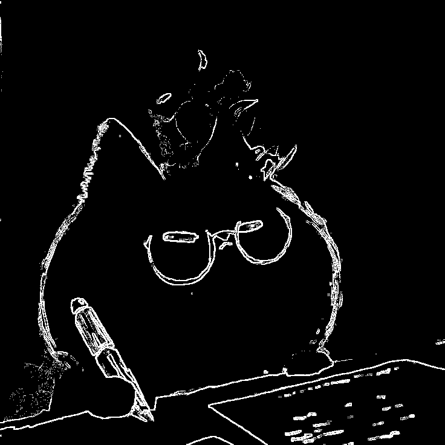</td>
  </tr>
</table>

### Градиентные матрицы

<table>
  <tr>
    <td>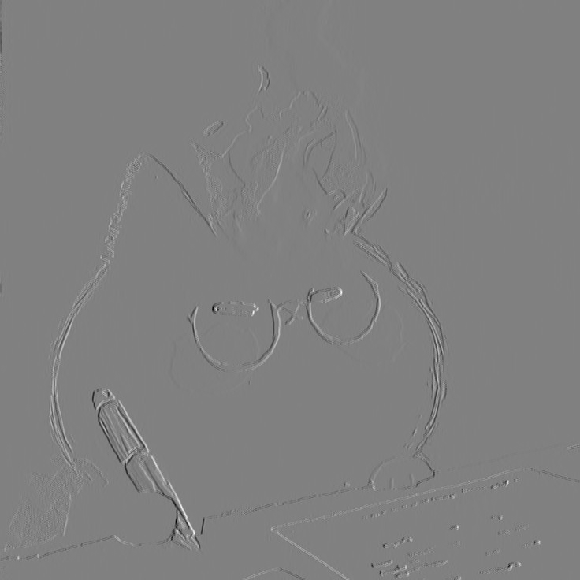</td>
    <td>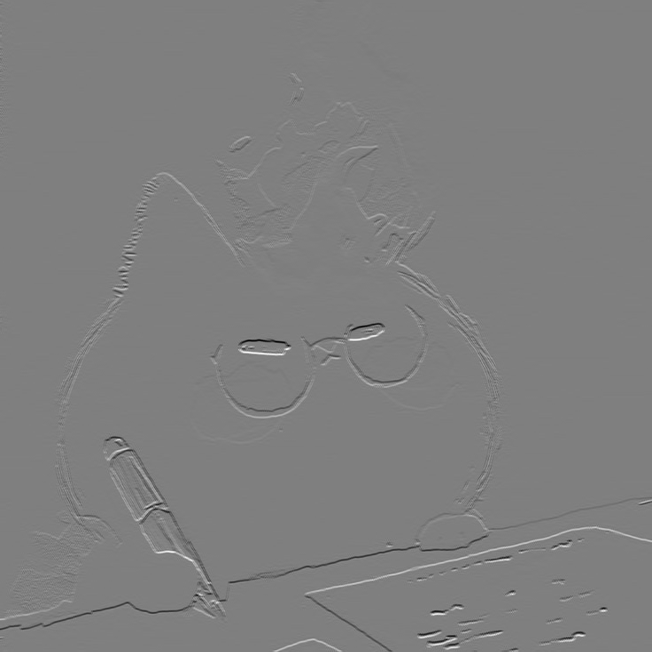</td>
    <td>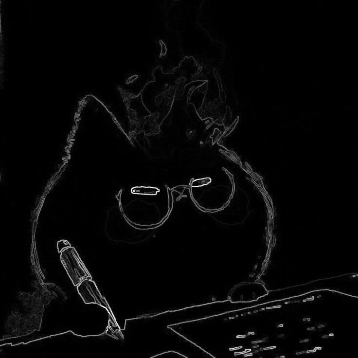</td>
  </tr>
</table>

## Текст

_Параметр: T = 80_

### Оригинальное изображение:

### Полутон, бинаризованная матрица:

<table>
  <tr>
    <td>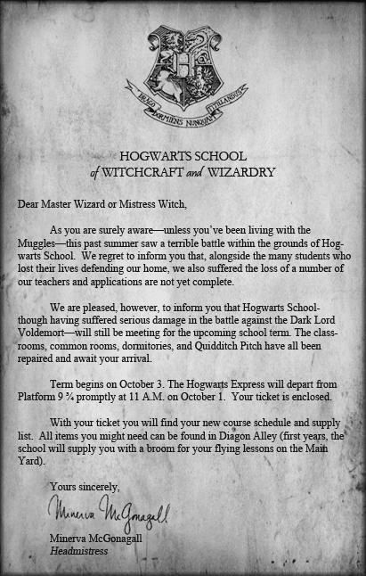</td>
    <td></td>
  </tr>
</table>

### Градиентные матрицы:

<table>
  <tr>
    <td>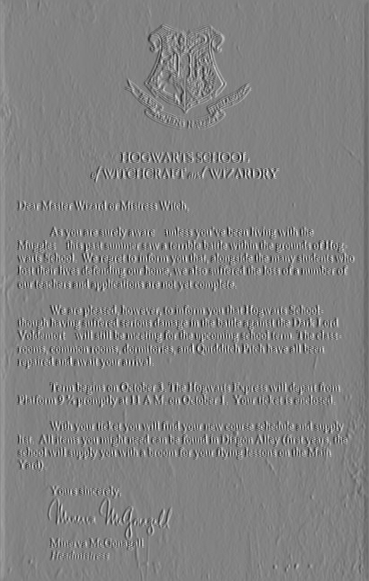</td>
    <td>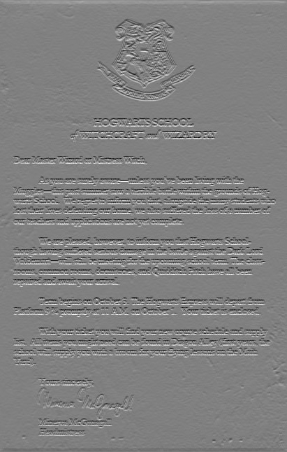</td>
    <td></td>
  </tr>
</table>

## Карта

### Оригинальное изображение:

_Параметр: T = 100_

### Полутон, бинаризованная матрица:

<table>
  <tr>
    <td>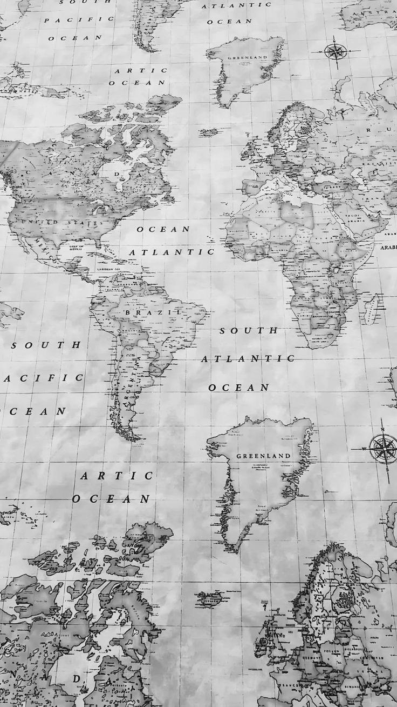</td>
    <td>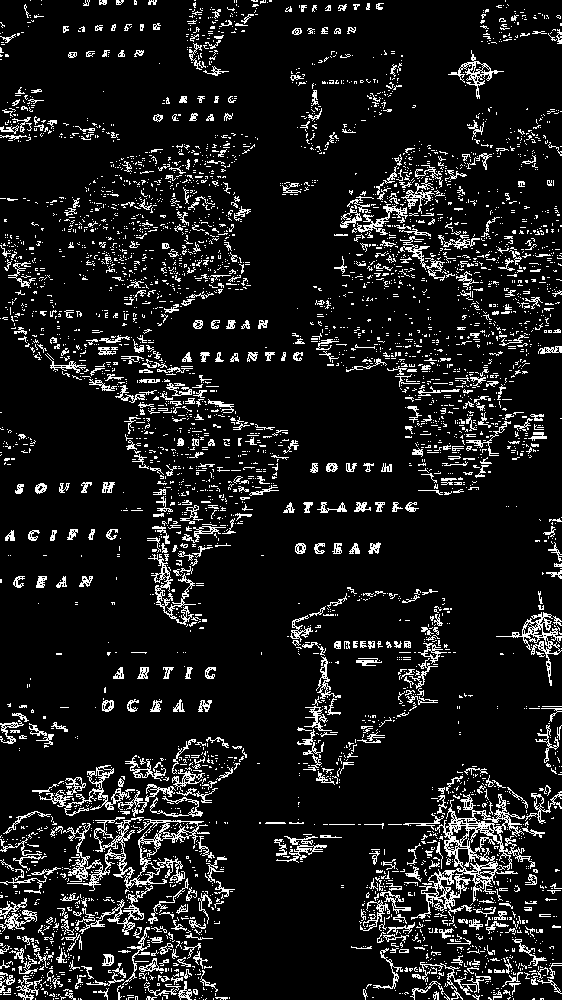</td>
  </tr>
</table>

### Градиентные матрицы:

<table>
  <tr>
    <td>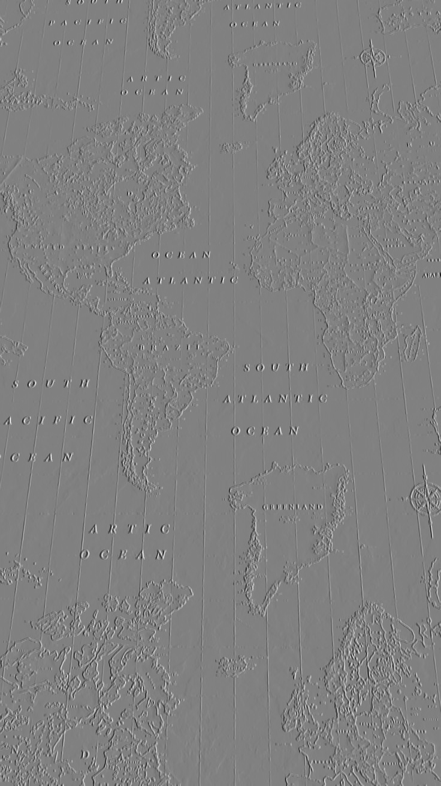</td>
    <td>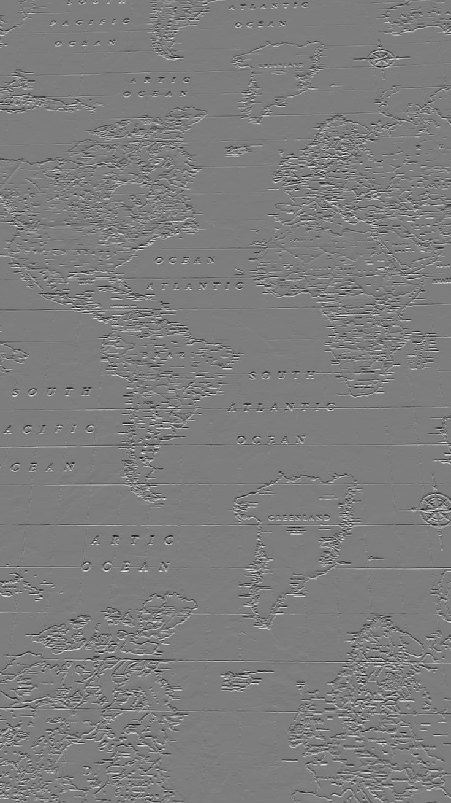</td>
    <td>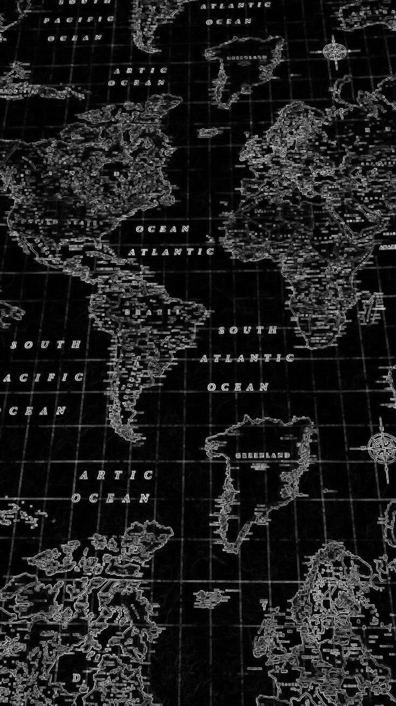</td>
  </tr>
</table>

## Рентген

### Оригинальное изображение:

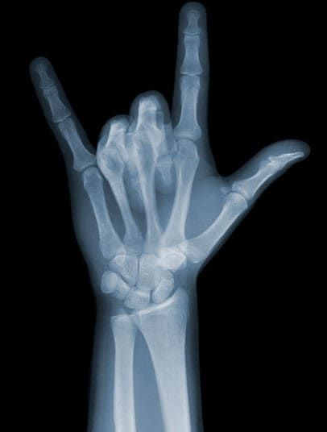

_Параметр: T = 40_

### Полутон, градиентные матрицы, бинаризованная матрица:

<table>
  <tr>
    <td>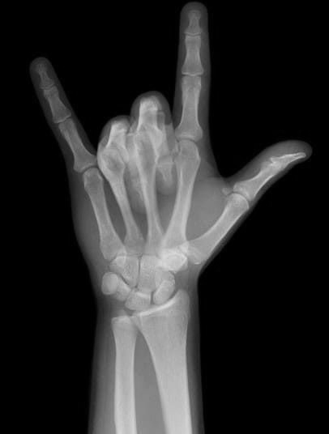</td>
    <td>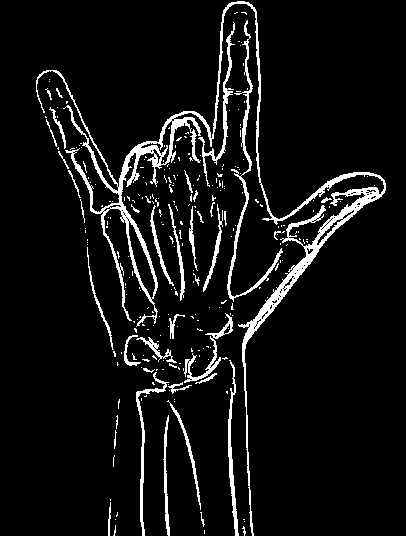</td>
  </tr>
</table>

### Градиентные матрицы:

<table>
  <tr>
    <td>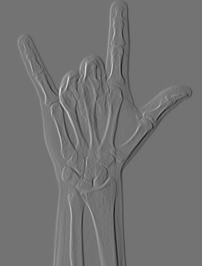</td>
    <td>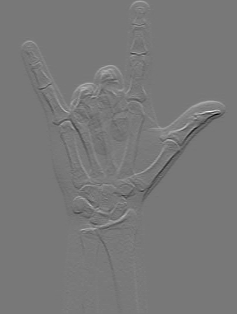</td>
    <td></td>
  </tr>
</table>
